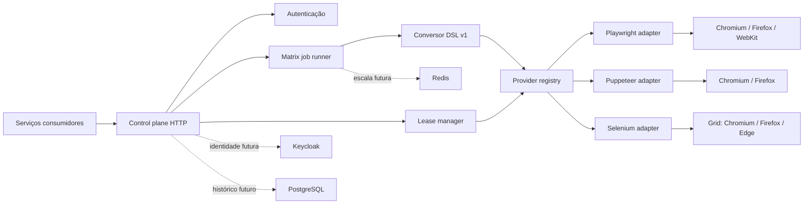

# Arquitetura

## Visão geral



O domínio conhece drivers, navegadores, jobs, leases e capacidade. Ele não conhece Fastify, Docker,
Keycloak, Redis nem PostgreSQL.

## Dois contratos

### Facade portável

O cliente envia um job declarativo, versionado e sem código executável. O matrix runner resolve os
alvos e cada session connector traduz as ações para a API nativa:

```text
JSON DSL v1 -> runner comum -> session port -> Playwright | Puppeteer | Selenium
```

Sem filtros, o runner usa todas as capacidades anunciadas pelos providers. Com somente um filtro,
expande o outro eixo pelas capacidades disponíveis. Com `drivers` e `browsers`, avalia o produto
cartesiano solicitado e marca combinações impossíveis como `unsupported`.

Falhar em uma combinação não cancela as outras. A concorrência da matriz é limitada por
`MAX_JOB_PARALLELISM`, enquanto `MAX_CONCURRENT_BROWSERS` continua sendo o limite global de sessões.

### Sessão nativa

O cliente escolhe `engine` e `browser`, aguarda capacidade, recebe um descritor de conexão e usa a
biblioteca original. Esse modo preserva funcionalidades sem equivalente comum, como tracing,
interceptação de rede, contexts avançados e APIs específicas.

O descritor separa `engine`, `browser` e `protocol`, permitindo adicionar WebDriver BiDi ou um
provider gerenciado sem alterar o lifecycle de leases.

## Matriz de capacidades

| Driver     | Chromium | Firefox | WebKit | Edge    |
| ---------- | -------- | ------- | ------ | ------- |
| Playwright | sim      | sim     | sim    | não     |
| Puppeteer  | sim      | sim     | não    | não     |
| Selenium   | config.  | config. | não    | config. |

A matriz representa capacidades reais, não aliases. Edge não é tratado como Chromium e WebKit não é
simulado em drivers que não o implementam.

## DSL v1

O parser aceita de 1 a 100 passos, strings e dimensões limitadas, timeouts limitados a 120 segundos
e somente URLs `http`, `https` ou `data`. Ações:

- navegação: `goto`, `back`, `forward`, `reload`;
- interação: `click`, `fill`, `type`, `press`, `hover`, `focus`, `check`, `uncheck`, `select`,
  `scroll`;
- sincronização: `wait`, `waitForSelector`, `waitForUrl`;
- viewport: `setViewport`;
- dados e testes: `extract`, `assert`, `screenshot`.

Cada adapter implementa a mesma porta de sessão. Os resultados preservam duração e falha por passo,
outputs nomeados e um status por combinação.

O v1 não contém `eval`, scripts arbitrários, interceptação de rede, upload/download, cookies,
contexts múltiplos, vídeos ou tracing. Esses recursos permanecem disponíveis no contrato nativo e só
entram na DSL quando houver semântica equivalente e testável nos três drivers.

## Providers

### Playwright

Um processo isolado é criado por lease. Sessões nativas passam pelo relay autenticado; jobs usam o
connector Playwright interno. Cliente e servidor nativos devem ter o mesmo `major.minor`.

### Puppeteer

Chromium reutiliza o executável instalado pelo Playwright. Firefox não pode reutilizar o build
patchado do Playwright: a imagem instala a revisão estável fixada pelo Puppeteer e aponta
`PUPPETEER_FIREFOX_EXECUTABLE_PATH` para ela. O protocolo nunca é apresentado como Playwright.

Firefox/WebDriver BiDi permite uma única sessão ativa. O job runner reutiliza internamente a sessão
criada pelo provider; essa combinação não é oferecida como lease nativo reconectável.

### Selenium

Selenium Grid é separado e já possui criação, fila e timeout de sessões WebDriver. O profile
`selenium` cria hub + Chromium; `selenium-all` adiciona Firefox e Edge. `SELENIUM_BROWSERS`
determina quais capacidades o control plane anuncia.

Em uma evolução com tenants não confiáveis, um gateway WebDriver/BiDi dedicado deverá esconder o
Grid e correlacionar session IDs com leases.

## Estado e evolução

### Uma VPS

- uma réplica do control plane;
- jobs síncronos e fila FIFO de leases em memória;
- API key na rede Docker privada;
- métricas Prometheus;
- sem banco.

### Múltiplos consumidores

- Keycloak com OAuth2 client credentials;
- escopos `jobs:run`, `leases:write` e `engines:read`;
- PostgreSQL para tenants, políticas, auditoria e metadados;
- segredo de sessão continua efêmero.

### Escala horizontal e jobs assíncronos

- Redis Streams ou BullMQ para jobs, retries e backpressure;
- workers por driver;
- scheduler por capacidade;
- object storage para screenshots, downloads, vídeos e traces;
- PostgreSQL guarda resultados duráveis, nunca processos de navegador.

O Redis do NSC Bot só pode ser reaproveitado se SLA, versão e isolamento forem compatíveis. Use
prefixo e credenciais dedicadas; a indisponibilidade do NSC não deve derrubar a plataforma.

## Segurança

- rede interna; nenhuma porta de driver exposta publicamente;
- segredo principal nunca vai na URL;
- token de lease aleatório, escopo único e expiração curta;
- um processo de navegador por lease;
- usuário Linux sem privilégios e limites de CPU/RAM;
- allowlist de ações e limites de entrada na DSL;
- URLs restritas a protocolos conhecidos;
- logs não registram tokens;
- perfis persistentes não entram no pool efêmero.

A restrição de protocolo não é uma defesa SSRF completa. Antes de aceitar jobs de tenants não
confiáveis, adicione política de destinos, bloqueio de IPs privados/metadados e resolução DNS
validada.

## Falhas esperadas

| Falha                  | Comportamento                                               |
| ---------------------- | ----------------------------------------------------------- |
| combinação impossível  | execução `unsupported`; as demais continuam                 |
| passo falha            | execução `failed` com resultados parciais                   |
| fila cheia             | `429` no contrato nativo                                    |
| espera expirada        | `408`; nenhuma sessão é criada                              |
| navegador não inicia   | lease removido e capacidade liberada                        |
| cliente não conecta    | lease expira após `LEASE_CONNECT_TIMEOUT_MS`                |
| conexão cai            | processo encerrado e próximo item FIFO atendido             |
| control plane reinicia | jobs síncronos/sessões caem; consumidor decide idempotência |
| Redis cai no futuro    | jobs assíncronos param; sessões ativas não são migradas     |
