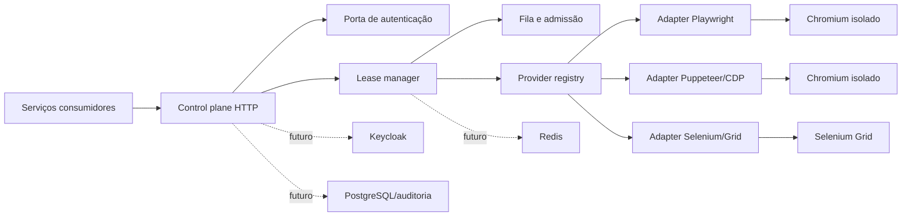

# Arquitetura

## Visão geral



O domínio conhece engines, protocolos, leases e capacidade. Ele não conhece Fastify, Docker,
Keycloak, Redis nem PostgreSQL.

## Contrato estável

O contrato comum é o control plane:

1. autenticar o cliente;
2. escolher o engine;
3. aguardar capacidade;
4. receber um descritor de conexão nativo;
5. usar a biblioteca original;
6. encerrar a sessão.

O descritor separa `engine` de `protocol`. Isso permite adicionar Firefox/WebKit, WebDriver BiDi ou
um provider gerenciado sem alterar o lifecycle de leases.

## Providers

### Playwright

`chromium.launchServer()` cria um processo por lease. O gateway faz relay do protocolo Playwright
sem expor a porta aleatória do processo. A versão cliente/servidor deve ter o mesmo `major.minor`.

### Puppeteer

`puppeteer-core` inicia o executável Chromium instalado na imagem e entrega CDP através do mesmo
relay autenticado. CDP não é apresentado como Playwright e vice-versa.

### Selenium

Selenium Grid é um runtime separado e já possui criação, fila e timeout de sessões WebDriver. O
adapter do control plane reserva uma cota e devolve o endpoint interno do Grid. Em uma evolução com
tenants não confiáveis, um gateway WebDriver/BiDi dedicado deverá esconder o Grid e correlacionar
session IDs com leases.

## Intermediário de ações portáveis

A futura facade de jobs será um caso de uso separado das sessões nativas. O contrato deve ser
versionado e declarativo:

```json
{
  "schemaVersion": 1,
  "engine": "auto",
  "steps": [
    { "action": "navigate", "url": "https://example.test" },
    { "action": "fill", "selector": "#name", "value": "Ana" },
    { "action": "click", "selector": "button[type=submit]" },
    { "action": "screenshot", "name": "result" }
  ]
}
```

Regras:

- sem `eval`, scripts arbitrários ou seletores executáveis;
- allowlist de ações e limites de tempo/tamanho;
- adapters declaram capabilities;
- `engine: auto` só escolhe providers que suportam todas as ações;
- artefatos usam storage próprio e URLs temporárias;
- idempotência é obrigatória em jobs com side effects.

Esse intermediário é útil para tarefas simples. Formulários complexos, testes E2E e sessões de
WhatsApp continuam no modo nativo.

## Estado e evolução

### Fase 1: uma VPS

- uma réplica do control plane;
- fila FIFO em memória;
- API key na rede Docker privada;
- métricas Prometheus;
- sem banco.

### Fase 2: múltiplos consumidores/tenants

- Keycloak com OAuth2 client credentials;
- escopos `browser:lease`, `engine:playwright`, `engine:selenium`;
- PostgreSQL para tenants, políticas, auditoria e metadados;
- segredo de sessão continua efêmero.

### Fase 3: escala horizontal e jobs

- Redis Streams ou BullMQ para jobs, retries e backpressure;
- workers por engine;
- scheduler escolhe worker por capacidade;
- object storage para screenshots, downloads, vídeos e traces;
- PostgreSQL guarda o resultado durável, não o processo do navegador.

Redis no NSC Bot pode ser reaproveitado apenas se SLA, versionamento e isolamento de chaves forem
compatíveis. Um prefixo e credenciais dedicadas são obrigatórios; indisponibilidade do NSC não deve
derrubar a plataforma inteira.

## Segurança

- rede interna; nenhuma porta de engine exposta publicamente;
- segredo principal nunca vai na URL;
- token de lease aleatório, escopo único e expiração curta;
- um processo de navegador por lease;
- usuário Linux sem privilégios e limites de CPU/RAM;
- sandbox do Chromium desativado dentro do container sem capabilities; o container é a fronteira de
  isolamento desta versão;
- URLs e cabeçalhos sensíveis redigidos em logs;
- SSRF controlado por política quando a facade de jobs for implementada;
- perfis persistentes não entram no pool efêmero.

## Falhas esperadas

| Falha                    | Comportamento                                              |
| ------------------------ | ---------------------------------------------------------- |
| fila cheia               | `429` com retry controlado pelo consumidor                 |
| espera expirada          | `408`; nenhuma sessão é criada                             |
| browser não inicia       | lease removido e capacidade liberada                       |
| cliente não conecta      | lease expira após `LEASE_CONNECT_TIMEOUT_MS`               |
| conexão cai              | processo encerrado e próximo item FIFO atendido            |
| control plane reinicia   | sessões nativas caem; clientes decidem retry/idempotência  |
| Redis cai na fase futura | jobs param de ser aceitos; sessões ativas não são migradas |
