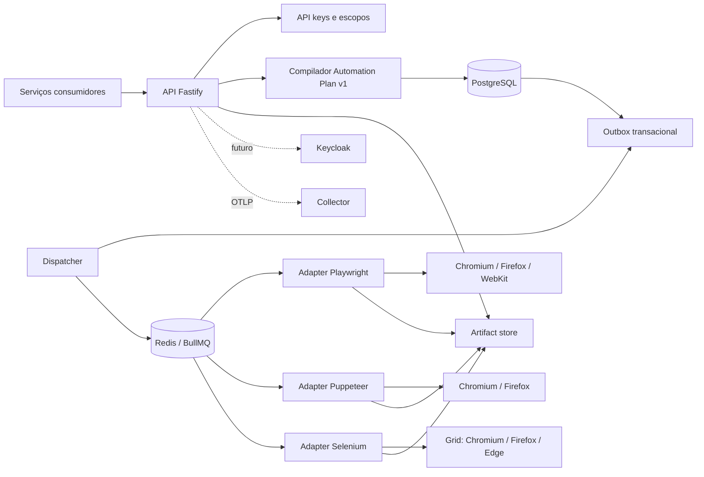

# Arquitetura

## Visão geral



O sistema é dividido em três papéis de processo:

- `api`: autentica, valida, compila, persiste e consulta;
- `dispatcher`: publica a outbox e remove artefatos expirados;
- `worker`: consome uma fila de adapter, faz claim atômico, cria a sessão nativa e executa o plano.

O control plane usa o artefato TypeScript selecionado por `APP_ROLE`. Cada adapter possui fila,
processo, imagem, dependências, concorrência e escala independentes. Apenas adapters que publicam
capacidades executáveis entram na matriz.

## Contrato e compilador

O TypeBox é a fonte única do contrato HTTP e dos tipos TypeScript:

```text
AutomationJobSchema -> JobCompiler -> ExecutionPlan[] -> ExecutionRecord[]
```

Regras da expansão:

1. sem filtros: todas as capacidades anunciadas;
2. somente `adapters`: todos os navegadores disponíveis nesses adapters;
3. somente `browsers`: os navegadores solicitados em todos os adapters disponíveis;
4. ambos: produto cartesiano solicitado;
5. combinação inexistente: execução terminal `unsupported`.

Cada adapter implementa a mesma porta `AutomationSession`. O plano é uma representação intermediária
declarativa e fechada. Não existe conversão textual Playwright→Selenium; existe uma representação
intermediária tipada, executada semanticamente por cada adapter. Isso evita traduzir código
arbitrário e mantém comportamento verificável.

## Persistência e entrega

O PostgreSQL é a fonte de verdade:

- `browser_jobs`: definição, cliente, idempotência e estado agregado;
- `browser_executions`: uma linha por adapter/navegador;
- `browser_outbox`: mensagens criadas na mesma transação do job;
- `browser_artifacts`: metadados e caminho do conteúdo;
- `browser_api_clients`: hash, escopos e ativação.

O endpoint nunca publica diretamente no Redis. Job, execuções e outbox são gravados na mesma
transação. O dispatcher usa `FOR UPDATE SKIP LOCKED`, publica no BullMQ e somente então marca a
mensagem como entregue. Se Redis estiver indisponível, a mensagem é desbloqueada e tentada
novamente.

BullMQ possui uma fila por adapter:

```text
browser-execution-playwright
browser-execution-puppeteer
browser-execution-selenium
browser-execution-webdriverio
browser-execution-nightwatch
browser-execution-testcafe
browser-execution-taiko
browser-execution-cypress
browser-execution-cdp
browser-execution-webdriver-bidi
browser-execution-appium
```

O ID da execução é também o `jobId` do BullMQ, reduzindo duplicação acidental. O estado final sempre
é persistido no PostgreSQL.

## Execução

O worker:

1. valida se a execução ainda está `queued`;
2. adquire unidades do semáforo local;
3. marca `running` e incrementa a tentativa;
4. resolve o adapter e abre sua sessão ou runner nativo;
5. verifica cancelamento antes de cada passo;
6. executa a DSL;
7. persiste artefatos e outputs;
8. fecha sessão/runner e libera capacidade.

WebKit consome duas unidades, pois costuma exigir mais recursos na VPS. A concorrência BullMQ limita
jobs simultâneos e o semáforo ponderado limita a pressão real sobre o container.

Falhas antes da sessão/passo são `infrastructure`; falhas do passo são `assertion`. Cancelamento é
cooperativo e consultado antes de cada ação.

## Consistência e idempotência

A chave única `(client_id, idempotency_key)` e o fingerprint canônico garantem idempotência mesmo
com APIs concorrentes. A criação usa advisory lock por cliente para aplicar a quota dentro da mesma
transação:

- mesma chave e definição: retorna o job vencedor;
- mesma chave e definição diferente: `409`;
- quota ativa excedida: `429`.

O agregado prioriza `running`, depois `queued`. Resultados mistos viram `partial`; combinações
somente falhas/unsupported viram `failed`.

## Artefatos

O backend é selecionado por `ARTIFACT_BACKEND=local|s3`. O modo local usa filesystem compartilhado;
o modo S3 aceita AWS S3 e implementações compatíveis:

- worker escreve com criação exclusiva;
- API lê pelo metadado persistido;
- dispatcher faz claim exclusivo, marca `deleting`, remove conteúdo e conclui a linha;
- falhas de remoção viram `retry`, sem perder o metadado;
- caminhos são resolvidos dentro da raiz e tentativas de escape são rejeitadas.

A porta `ArtifactStore` permite substituir o volume por S3/MinIO sem alterar compilador, runner ou
API.

## Segurança

- contrato fechado, sem `eval`;
- limites de tamanho, quantidade e timeout;
- somente `http`, `https` e `data` em `goto`;
- resolução DNS e bloqueio IPv4/IPv6 privado, loopback, link-local, CGNAT e multicast;
- `ALLOWED_HOSTS` explícito para exceções internas;
- chaves armazenadas como SHA-256, nunca em texto puro;
- escopos por rota;
- Grid, Redis e PostgreSQL apenas na rede Docker;
- API publicada em loopback;
- containers sem capabilities e com `no-new-privileges`.

A política valida o DNS antes da execução, mas não elimina sozinha DNS rebinding. Para tenants não
confiáveis expostos à internet, o próximo nível é um proxy de saída com regras de rede e resolução
fixada.

## Autenticação e Keycloak

API key com escopos é suficiente para consumidores internos da mesma VPS e reduz dependências
operacionais. `Authenticator` é uma porta da aplicação. Keycloak deve ser adicionado quando houver:

- acesso externo;
- múltiplos tenants/equipes;
- rotação centralizada;
- auditoria de identidade;
- OAuth2 client credentials obrigatório.

Nesse cenário, um adapter JWT/JWKS substitui o adapter PostgreSQL sem alterar handlers ou casos de
uso.

## Observabilidade

Quando `OTEL_EXPORTER_OTLP_ENDPOINT` está definido:

- traces: `/v1/traces`;
- métricas: `/v1/metrics`;
- atributos: job, execução, adapter, navegador, status e duração.

Health checks distinguem processo vivo de dependências prontas. O shutdown interrompe consumo, fecha
servidor, filas, pool e telemetria.

## Redis compartilhado

Reutilizar o Redis do NSC Bot é tecnicamente possível, mas não é o padrão recomendado. Exige:

- credencial própria;
- database ou instância lógica isolada;
- memória e eviction compatíveis com BullMQ;
- persistência AOF;
- SLA comum aceito;
- monitoramento de latência e backlog.

Sem essas garantias, use uma credencial, database e política de retenção dedicados no Redis externo
da VPS para que uma falha ou limpeza de outro serviço não interrompa os jobs de navegador.

## Limites deliberados do Automation Plan v2

Ficam fora até existir semântica equivalente nos três adapters:

- JavaScript arbitrário;
- interceptação de rede;
- cookies e múltiplos contexts;
- upload/download;
- vídeo e tracing nativo;
- perfis persistentes.

Esses recursos devem entrar como ações portáteis versionadas ou como um serviço especializado, não
como escapes específicos de adapter dentro do mesmo job.

## Testes

O gate inclui todos os arquivos `src/**/*.ts`:

- 100% statements;
- 100% branches;
- 100% functions;
- 100% lines.

Os adapters são testados contra doubles dos SDKs; a validação de release acrescenta PostgreSQL,
Redis, containers e matriz real de navegadores.
